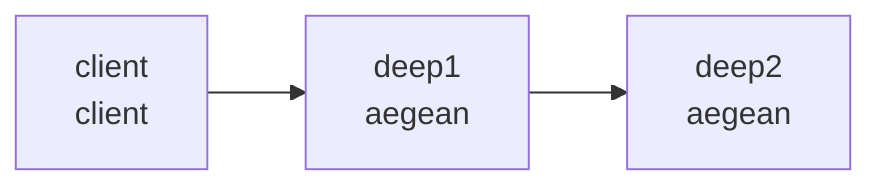

# deep_2_aegean Service Topology

Source: [../architecture/deep_2_aegean.yaml](../architecture/deep_2_aegean.yaml)

```mermaid
flowchart LR
  client["client<br/>client"]
  deep1["deep1<br/>aegean"]
  deep2["deep2<br/>aegean"]

  client --> deep1
  deep1 --> deep2
```
