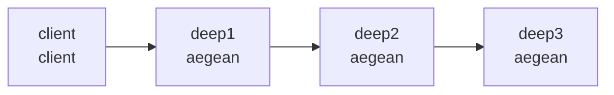

# deep_3_aegean Service Topology

Source: [../architecture/deep_3_aegean.yaml](../architecture/deep_3_aegean.yaml)

```mermaid
flowchart LR
  client["client<br/>client"]
  deep1["deep1<br/>aegean"]
  deep2["deep2<br/>aegean"]
  deep3["deep3<br/>aegean"]

  client --> deep1
  deep1 --> deep2
  deep2 --> deep3
```
