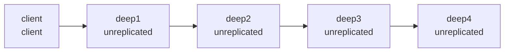

# deep_4_unreplicated Service Topology

Source: [../architecture/deep_4_unreplicated.yaml](../architecture/deep_4_unreplicated.yaml)

```mermaid
flowchart LR
  client["client<br/>client"]
  deep1["deep1<br/>unreplicated"]
  deep2["deep2<br/>unreplicated"]
  deep3["deep3<br/>unreplicated"]
  deep4["deep4<br/>unreplicated"]

  client --> deep1
  deep1 --> deep2
  deep2 --> deep3
  deep3 --> deep4
```
