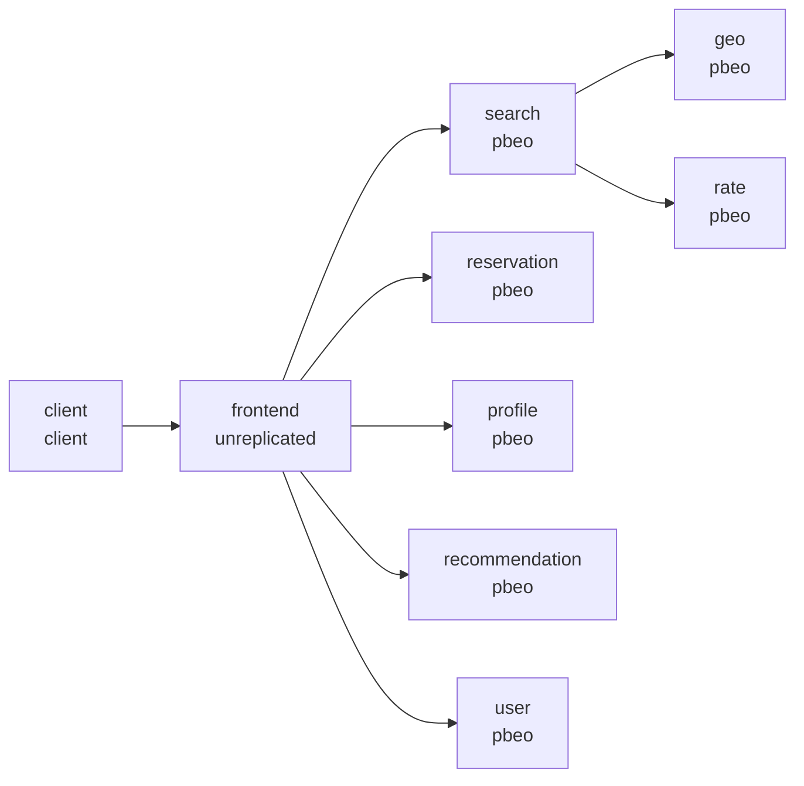

# hotel_hotels_pbeo Service Topology

Source: [../architecture/hotel_hotels_pbeo.yaml](../architecture/hotel_hotels_pbeo.yaml)

```mermaid
flowchart LR
  client["client<br/>client"]
  frontend["frontend<br/>unreplicated"]
  search["search<br/>pbeo"]
  geo["geo<br/>pbeo"]
  rate["rate<br/>pbeo"]
  reservation["reservation<br/>pbeo"]
  profile["profile<br/>pbeo"]
  recommendation["recommendation<br/>pbeo"]
  user["user<br/>pbeo"]

  client --> frontend
  frontend --> search
  search --> geo
  search --> rate
  frontend --> reservation
  frontend --> profile
  frontend --> recommendation
  frontend --> user
```
