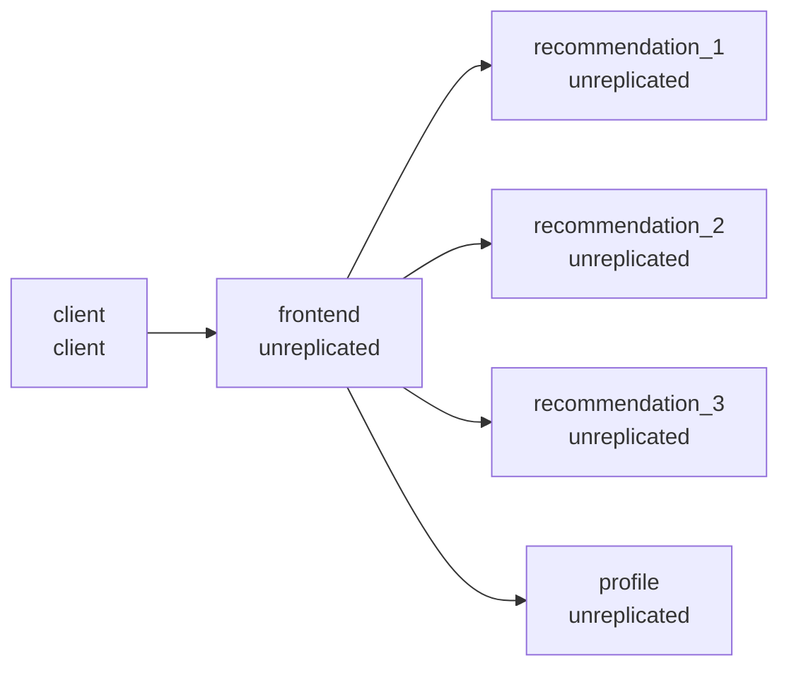

# hotel_recommendations_unreplicated Service Topology

Source: [../architecture/hotel_recommendations_unreplicated.yaml](../architecture/hotel_recommendations_unreplicated.yaml)

```mermaid
flowchart LR
  client["client<br/>client"]
  frontend["frontend<br/>unreplicated"]
  profile["profile<br/>unreplicated"]
  recommendation_1["recommendation_1<br/>unreplicated"]
  recommendation_2["recommendation_2<br/>unreplicated"]
  recommendation_3["recommendation_3<br/>unreplicated"]

  client --> frontend
  frontend --> recommendation_1
  frontend --> recommendation_2
  frontend --> recommendation_3
  frontend --> profile
```
