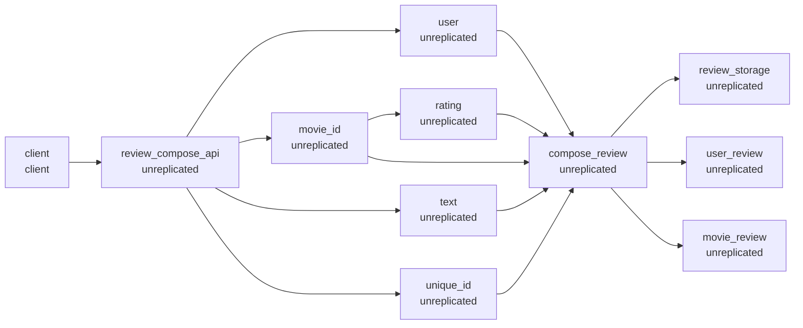

# media_review_compose_unreplicated Service Topology

Source: [../architecture/media_review_compose_unreplicated.yaml](../architecture/media_review_compose_unreplicated.yaml)

```mermaid
flowchart LR
  client["client<br/>client"]
  review_compose_api["review_compose_api<br/>unreplicated"]
  user["user<br/>unreplicated"]
  movie_id["movie_id<br/>unreplicated"]
  text["text<br/>unreplicated"]
  unique_id["unique_id<br/>unreplicated"]
  rating["rating<br/>unreplicated"]
  compose_review["compose_review<br/>unreplicated"]
  review_storage["review_storage<br/>unreplicated"]
  user_review["user_review<br/>unreplicated"]
  movie_review["movie_review<br/>unreplicated"]

  client --> review_compose_api
  review_compose_api --> user
  review_compose_api --> movie_id
  review_compose_api --> text
  review_compose_api --> unique_id
  movie_id --> rating
  user --> compose_review
  movie_id --> compose_review
  text --> compose_review
  unique_id --> compose_review
  rating --> compose_review
  compose_review --> review_storage
  compose_review --> user_review
  compose_review --> movie_review
```
