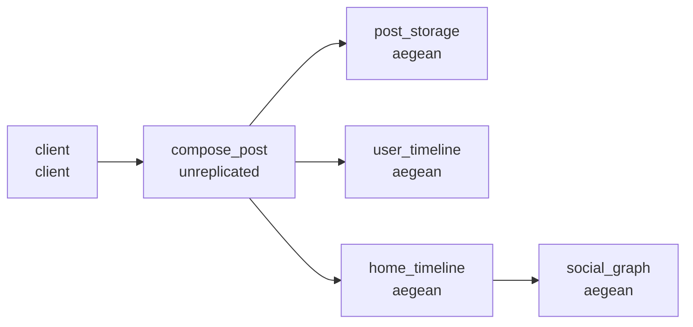

# social_compose_aegean Service Topology

Source: [../architecture/social_compose_aegean.yaml](../architecture/social_compose_aegean.yaml)

```mermaid
flowchart LR
  client["client<br/>client"]
  compose_post["compose_post<br/>unreplicated"]
  post_storage["post_storage<br/>aegean"]
  user_timeline["user_timeline<br/>aegean"]
  home_timeline["home_timeline<br/>aegean"]
  social_graph["social_graph<br/>aegean"]

  client --> compose_post
  compose_post --> post_storage
  compose_post --> user_timeline
  compose_post --> home_timeline
  home_timeline --> social_graph
```
