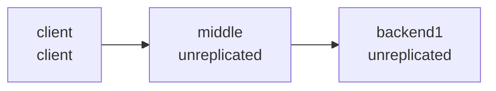

# wide_1_unreplicated Service Topology

Source: [../architecture/wide_1_unreplicated.yaml](../architecture/wide_1_unreplicated.yaml)

```mermaid
flowchart LR
  client["client<br/>client"]
  middle["middle<br/>unreplicated"]
  backend1["backend1<br/>unreplicated"]

  client --> middle
  middle --> backend1
```
