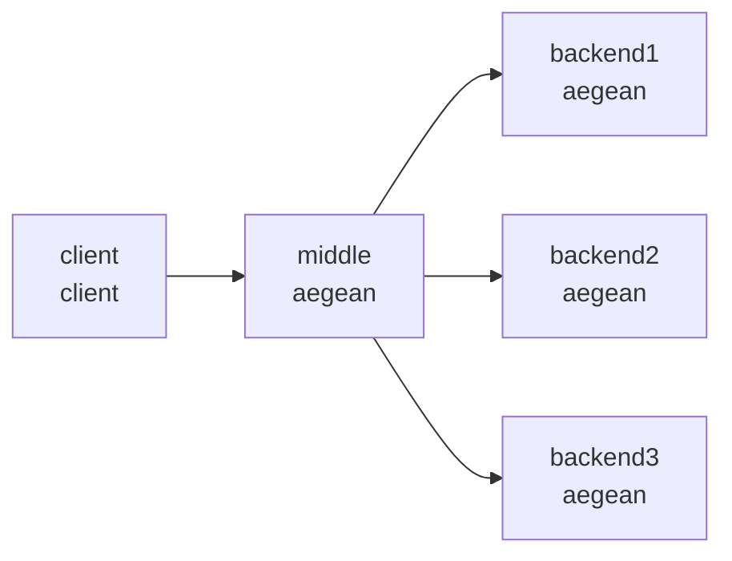

# wide_3_aegean Service Topology

Source: [../architecture/wide_3_aegean.yaml](../architecture/wide_3_aegean.yaml)

```mermaid
flowchart LR
  client["client<br/>client"]
  middle["middle<br/>aegean"]
  backend1["backend1<br/>aegean"]
  backend2["backend2<br/>aegean"]
  backend3["backend3<br/>aegean"]

  client --> middle
  middle --> backend1
  middle --> backend2
  middle --> backend3
```
