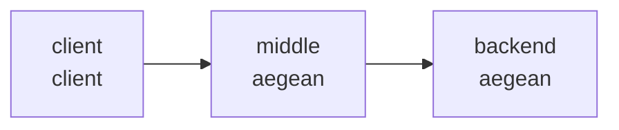

# write_aegean Service Topology

Source: [../architecture/write_aegean.yaml](../architecture/write_aegean.yaml)

```mermaid
flowchart LR
  client["client<br/>client"]
  middle["middle<br/>aegean"]
  backend["backend<br/>aegean"]

  client --> middle
  middle --> backend
```
